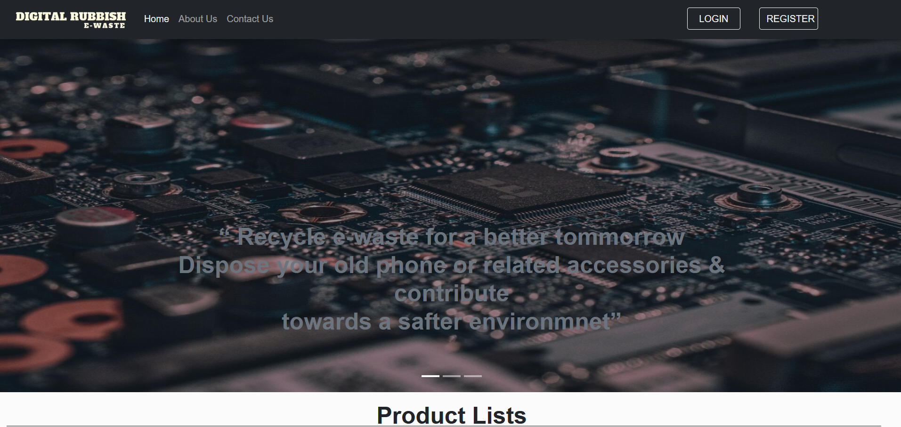
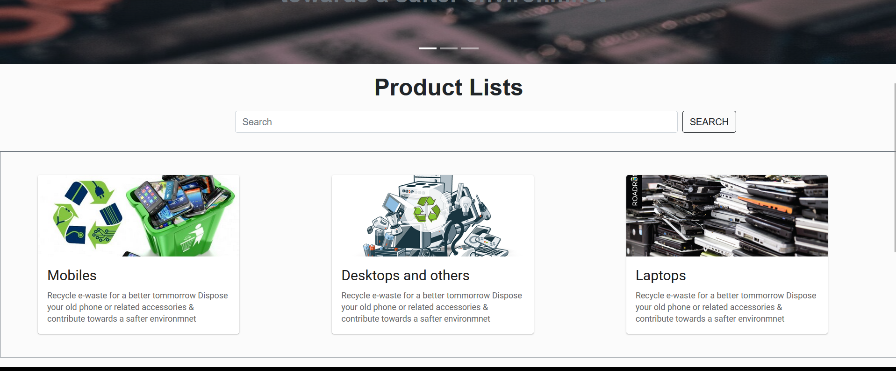
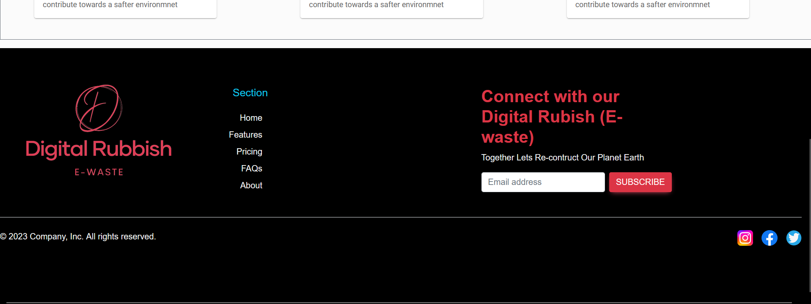

# E-Waste Management System

## Overview

The E-Waste Management System is a MERN stack application designed to facilitate the management of electronic waste. It allows users to register, log in, and authenticate themselves to access features for tracking and managing e-waste efficiently. The application is built using React.js, Node.js, and MongoDB.

## Features

- **User Authentication**: Secure login and registration with authentication.
- **User Management**: Allows users to create an account and manage their profile.
- **Dashboard**: Provides an overview of e-waste data and management options.
- **E-Waste Tracking**: Track and manage different types of electronic waste.
- **Responsive Design**: Works seamlessly across various devices and screen sizes.

## Screenshots

### Home Page



The Home Page provides users with an overview of the application and easy access to the main features.

### Main Content



The Main Content section displays key functionalities and allows users to interact with the system for managing e-waste.

### Footer



The Footer includes additional links and information about the application.

## Technologies Used

- **Frontend**: React.js
- **Backend**: Node.js
- **Database**: MongoDB
- **Authentication**: JWT (JSON Web Tokens)

## Getting Started

### Prerequisites

- Node.js and npm installed on your local machine.
- MongoDB installed and running (or access to a remote MongoDB instance).

### Installation

1. **Clone the Repository**

   ```bash
   git clone https://github.com/yourusername/e-waste-management-system.git
   ```

2. **Navigate to the Project Directory**

   ```bash
   cd e-waste-management-system
   ```

3. **Install Backend Dependencies**

   ```bash
   cd backend
   npm install
   ```

4. **Install Frontend Dependencies**

   ```bash
   cd ../frontend
   npm install
   ```

5. **Configure Environment Variables**

   Create a `.env` file in the `backend` directory and add the following variables:

   ```env
   MONGODB_URI=your_mongodb_uri
   JWT_SECRET=your_jwt_secret
   PORT=5000
   ```

   Configure the frontend to connect to the backend by setting the API base URL in the `frontend/src/config.js` file.

6. **Run the Application**

   Start the backend server:

   ```bash
   cd backend
   npm start
   ```

   Start the frontend server:

   ```bash
   cd ../frontend
   npm start
   ```

   The application will be available at `http://localhost:3000` and the backend API at `http://localhost:5000`.

## Usage

1. **Register a New Account**

   - Go to the registration page and fill in the required details.
   - Submit the form to create a new account.

2. **Log In**

   - Enter your credentials on the login page to access the dashboard.

3. **Manage E-Waste**

   - Use the dashboard to track and manage electronic waste records.

## Contributing

Feel free to open issues or submit pull requests if you have suggestions or improvements for the project.


## Contact

For any questions or feedback, please contact [daharupesh21@example.com].

---
